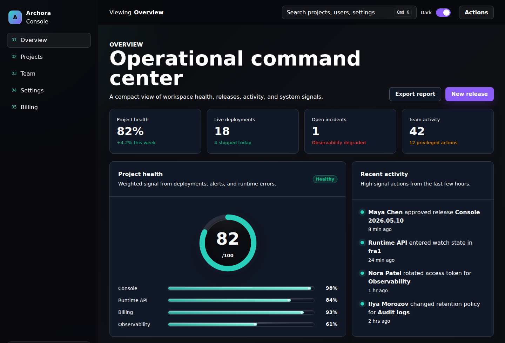
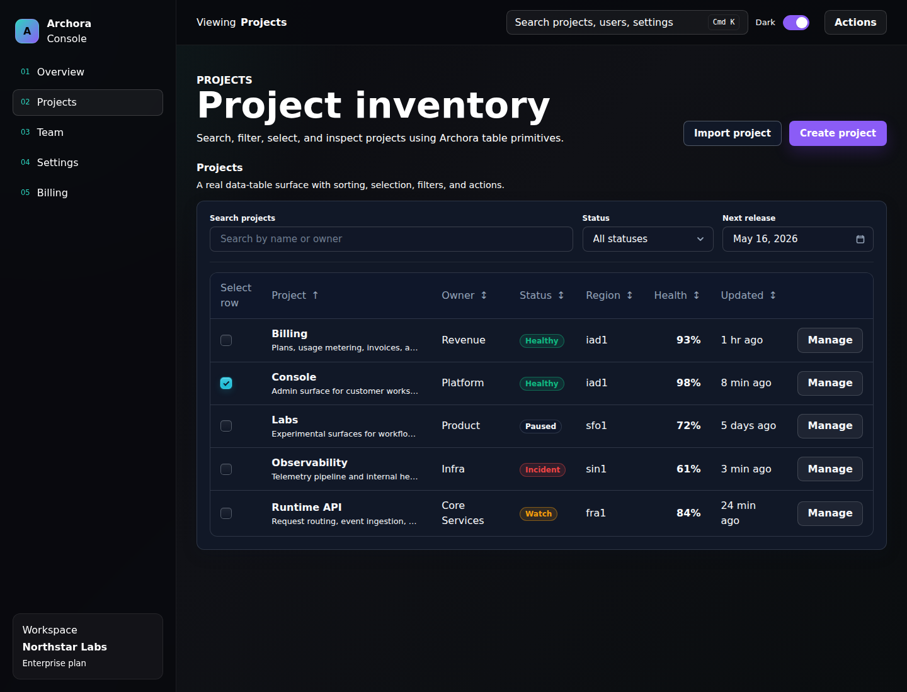
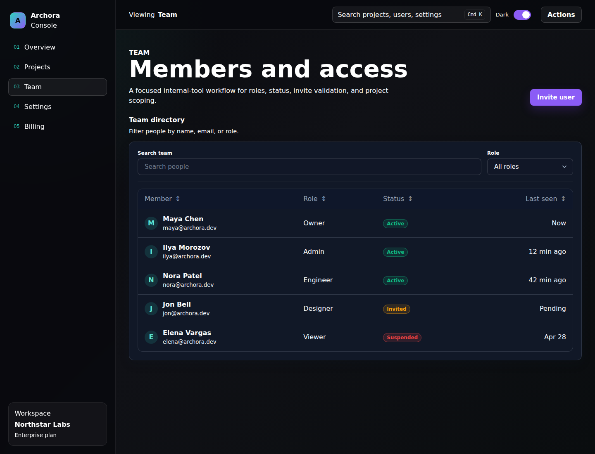
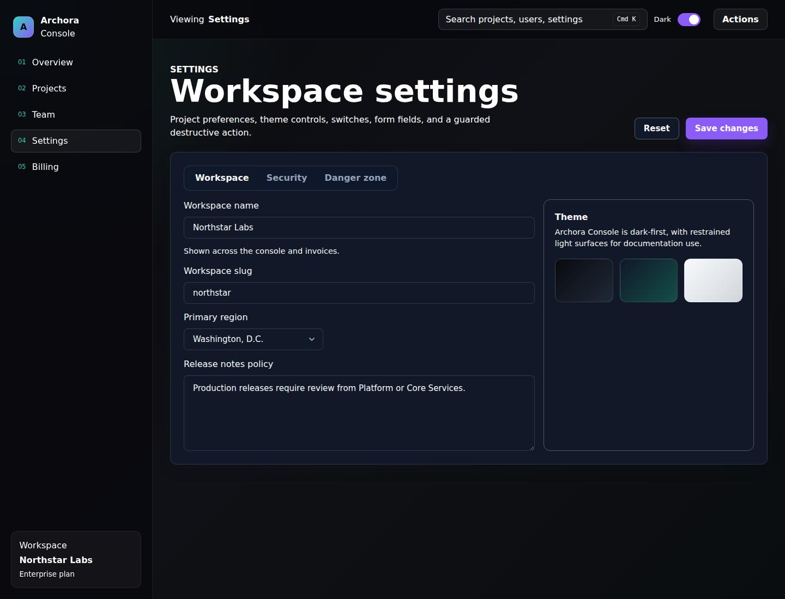
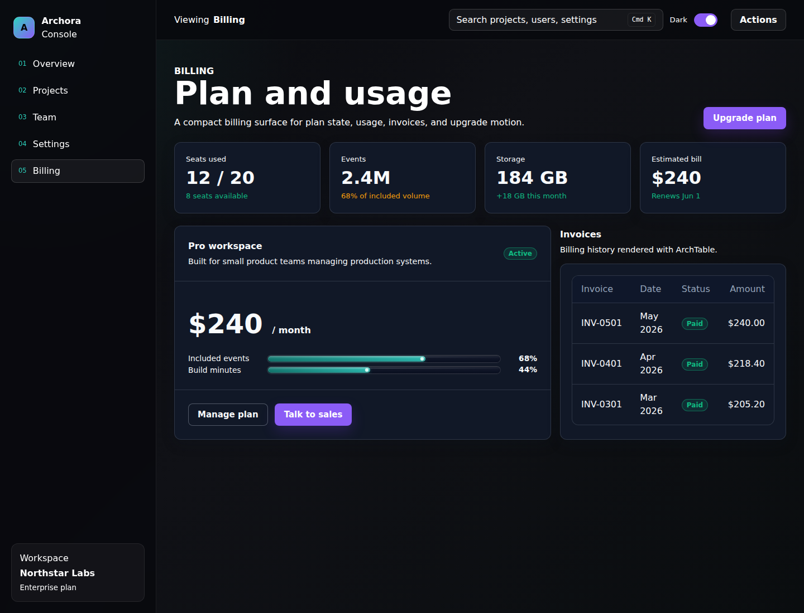
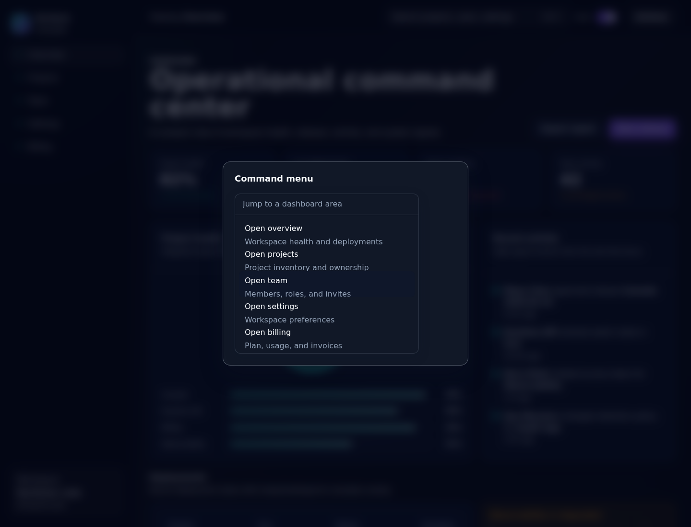

# Archora UI

Dark-first Vue 3 design system for premium dashboards and internal tools.



Archora UI is a Vue 3 + TypeScript UI-kit with design tokens, accessible components, docs,
Histoire playground, and a real dashboard demo.

## Features

- Vue 3 + TypeScript
- Dark, light, and system themes
- Design tokens through CSS variables
- Accessible interactive components
- Vite library build
- Histoire playground
- VitePress docs
- Archora Console demo
- Tests and package smoke coverage

## Quick Start

```sh
pnpm add @archora/ui
```

```ts
import { ArchButton } from "@archora/ui";
import "@archora/ui/styles.css";
```

## Local Development

```sh
corepack pnpm install
corepack pnpm dev:docs
corepack pnpm dev:playground
corepack pnpm dev:demo
```

## Quality

The public preview gate uses:

```sh
corepack pnpm lint
corepack pnpm typecheck
corepack pnpm test
corepack pnpm build
corepack pnpm stylelint
corepack pnpm format:check
corepack pnpm build:demo
corepack pnpm smoke:demo
```

`smoke:demo` starts the Archora Console demo in Chromium, checks primary screens and overlay states
for horizontal overflow, verifies that browser console errors are absent, and writes clean portfolio
screenshots.

## Screenshots

| Overview                                                                                          | Projects                                                                                          |
| ------------------------------------------------------------------------------------------------- | ------------------------------------------------------------------------------------------------- |
|  |  |

| Team                                                                                      | Settings                                                                                          |
| ----------------------------------------------------------------------------------------- | ------------------------------------------------------------------------------------------------- |
|  |  |

| Billing                                                                                         | Command Menu                                                                                              |
| ----------------------------------------------------------------------------------------------- | --------------------------------------------------------------------------------------------------------- |
|  |  |

## Packages

- `packages/ui`: component library and public exports
- `packages/tokens`: design token source
- `packages/icons`: icon package boundary
- `apps/docs`: VitePress documentation
- `apps/playground`: Histoire component playground
- `apps/demo`: Archora Console dashboard demo

## Roadmap

- Publish package metadata and first Changeset-managed release.
- Improve typed row ergonomics for `ArchTable` and `ArchDataTable`.
- Add a more composable dropdown trigger API.
- Expand browser smoke only where it protects public preview workflows.

## Status

Archora UI is in public preview. The component foundation, docs, playground, demo, screenshots, and
quality gates are ready for GitHub and portfolio review.

MIT licensed.
