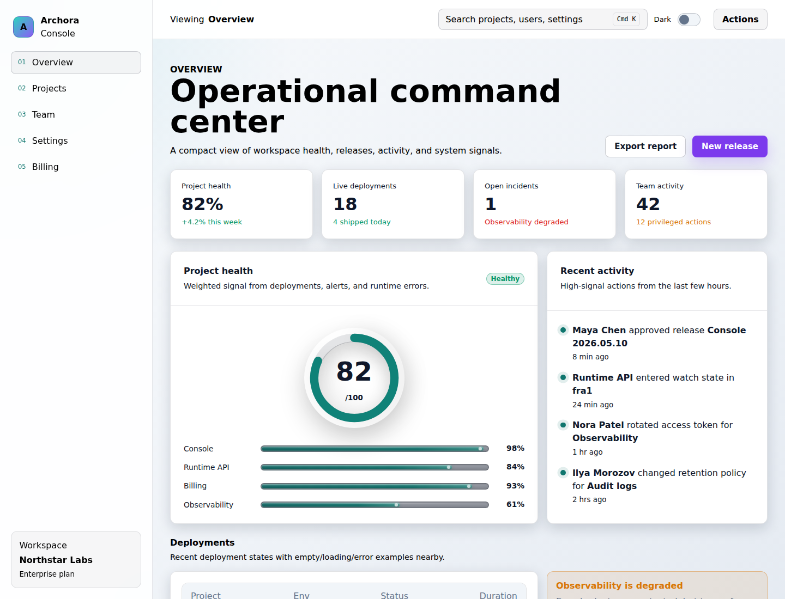
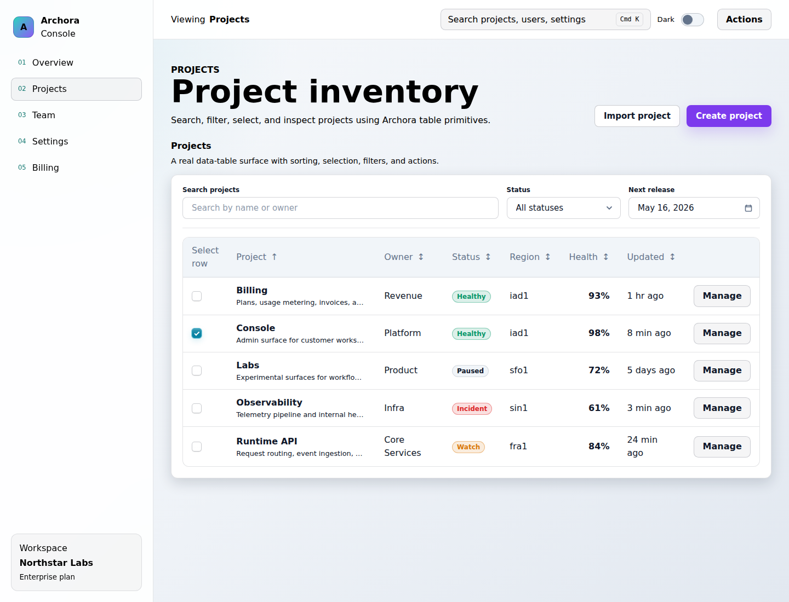
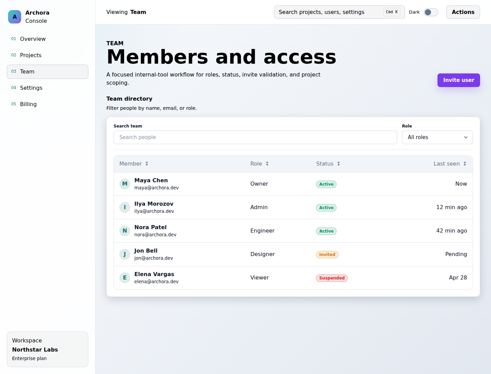
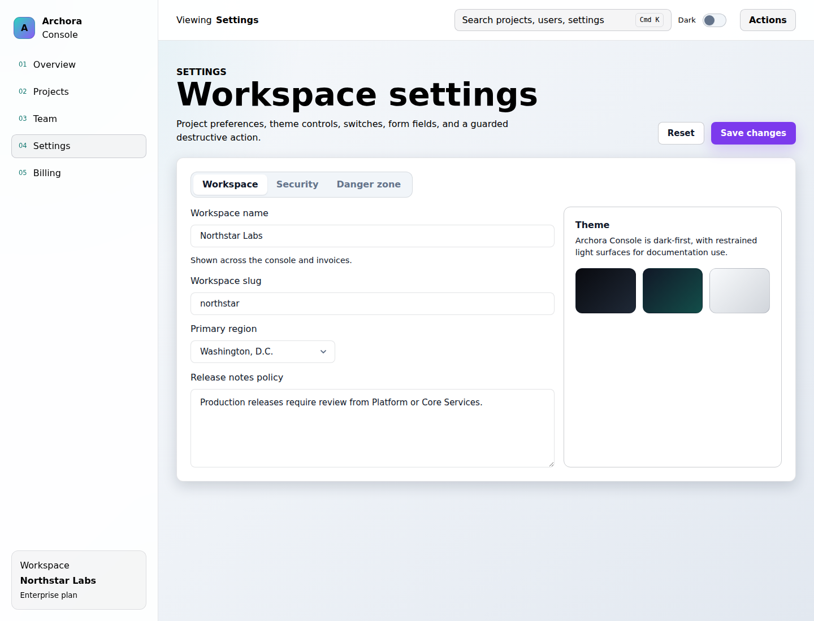
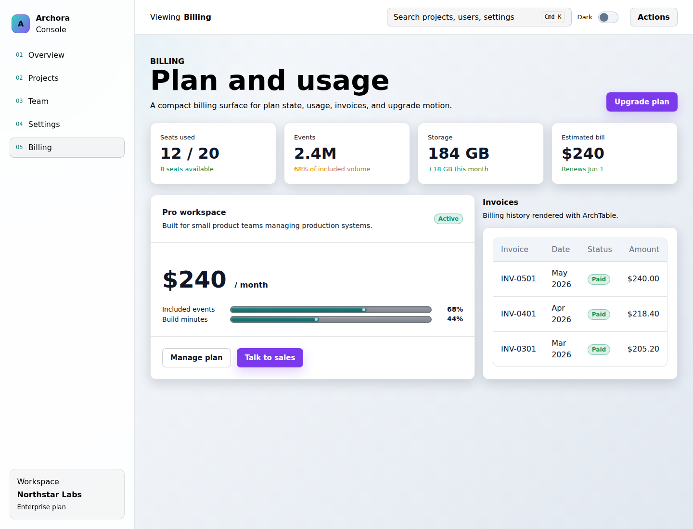

# Dashboard Demo

Archora Console is the real-world consumer app for `@archora/ui`. It shows how the library feels
inside a premium dark Vue 3 admin console instead of isolated component examples.


The demo app lives in `apps/demo` and imports the package through the public consumer contract:

```ts
import { ArchButton, ArchCard, ArchDataTable } from "@archora/ui";
import "@archora/ui/styles.css";
```

## Run Locally

```sh
corepack pnpm dev:demo
corepack pnpm build:demo
corepack pnpm smoke:demo
```

`dev:demo` builds the UI package first, then starts the Vite app so the demo resolves the same
package exports that an external consumer uses.

`smoke:demo` starts the demo in Chromium, checks primary screens and overlay states for horizontal
overflow, verifies that browser console errors are absent, and writes dark and light screenshots to
`apps/docs/.vitepress/public/screenshots`.

## Screens

- Overview: workspace metrics, project health, recent activity, deployment status, and state examples.
- Projects: searchable and sortable project table with selection, status badges, action menu, and details dialog.
- Team: user directory, roles, invite dialog, validation, select, and combobox flows.
- Settings: tabs, inputs, textarea, switches, theme swatches, destructive action guard, and save toast.
- Billing: plan card, usage bars, invoices table, and upgrade CTA.

## Screenshots

| Overview                                                                                          | Projects                                                                                          |
| ------------------------------------------------------------------------------------------------- | ------------------------------------------------------------------------------------------------- |
|  |  |

| Team                                                                                      | Settings                                                                                          |
| ----------------------------------------------------------------------------------------- | ------------------------------------------------------------------------------------------------- |
|  |  |

| Billing                                                                                         | Command Menu                                                                                            |
| ----------------------------------------------------------------------------------------------- | ------------------------------------------------------------------------------------------------------- |
|  |  |

## Light Theme Preview

| Overview                                                                                               | Projects                                                                                               |
| ------------------------------------------------------------------------------------------------------ | ------------------------------------------------------------------------------------------------------ |
|  |  |

| Team                                                                                           | Settings                                                                                               |
| ---------------------------------------------------------------------------------------------- | ------------------------------------------------------------------------------------------------------ |
|  |  |

| Billing                                                                                              |
| ---------------------------------------------------------------------------------------------------- |
|  |

The demo is the primary public preview surface for README screenshots, docs landing links, and
future product exploration.
